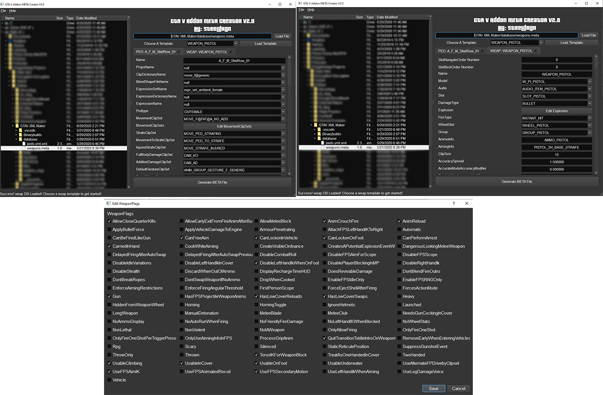

# Grand Theft Auto V Addon XML/Meta Generator V2.0

Tired of copying and pasting `XML` elements, changing desired parameters, and making sure your syntax is correct for every file your custom addon needs? This is the tool for you!

This is a GUI tool used to generate `.meta` files for custom addon peds, weapons, and even vehicles<sup>1</sup>.

Now there is no need to copy, paste, and change individual files for every addon you make. Rest assured you will never forget a closing `XML` `</tag>` again.

>:information_source: This tool is intended for content creators as already made peds, weapons, and vehicles come with their modified files.

<sub>1 - :x: NOT CURRENTLY AVAILABLE. See planned features below.</sub>

### :package: Check `Release` section for the latest built binaries!



### Current Features V2.0 - 20 June 2020

:white_check_mark: :memo: Generate `peds.meta` or `weapons.meta` file automatically

- Automatically adds your custom ped or weapon to an existing `peds.meta` or `weapons.meta` file if you have one already.

- `Meta` file is human readable (*pretty printed*)!

:white_check_mark: Use an existing ped template for quick `meta` file generation

- Tweak what you want, how you want quickly.

:white_check_mark: Shows all possible native entries for each ped parameter

:white_check_mark: Full graphical user interface

- Tabbed functionality! Work on multiple peds/weapons at once!

:white_check_mark:  :pushpin: Persistent directory tree

- Last file used will show up again in the directory tree! Avoid having to expand and collapse the tree manually at every startup!
  
## :hourglass: Planned Features

:white_large_square: Add logging support for issues.

:white_check_mark: Generate addon `weapons.meta` file

- :white_large_square: Other weapon files (eg. `weaponanimations.meta`, `weaponcomponents.meta`, etc).

:white_large_square: Generate addon `vehicles.meta` file and all associated vehicle files.

:white_large_square: Ability to add custom tags/ add more tags for a parameter set (eg. `MovementClipSets` in `peds.meta`).

:white_large_square: Smarter parameter value searches along with specific parameter search.

## How To Run

**Application coded with `python 3.7.4`**

1. Clone the repo with ```git clone```.
2. Install required dependencies below.
3. Run `GTAV_QTApp.py`.

### Required Dependencies

1. PyQt5: ```pip install PyQt5```
2. lxml: ```pip install lxml```

## How To Use

1. **Load Database**
   - Double click your `XML` or `META` file located in the `database` folder.
     - Use the directory tree on the left or the menu bar (File -> Load).
     - You should see the path to the file autopopulate the box next to the `Load File` button.
   - This will load a database of the `META` file that you can use as a template for your addon ped.
   - For `peds.ymt.xml`, there is a total of :heavy_exclamation_mark: **683** different peds with :heavy_exclamation_mark:  **71** parameters per ped! Most ped parameters are unused. Experiment with them!
2. **Select A Template**
   - Select a template to use as a starter. This saves time having to input each parameter individually.
   - Click `Load Template` button
3. **Edit Parameters**
   - Tweak and edit any parameter you would like.
   - Minimum change should be the name of the custom object.
4. **Generate `META` file**
    >:warning: Warning: This will overwrite an existing `META` file and append the object to the file. If this was a mistake, locate the generated file and delete the generated entry.
   - Click the `Generate XML` button and pick a save location.
   - You must double-click the directory you want the file to save to.
5. **Enjoy!**
   - Locate your generated `META` file and move it to your desired location.
   - Enjoy your addons!

## Change Log

### [v2.0] - 20 June 2020

- Addon weapon support! Can read and write a `weapons.meta` file!

- Tabbed functionality

### [v1.0] - 01 June 2020

- Initial release.

- Addon peds support. Can read and write a `peds.ymt.xml`/`peds.meta` file respectively.

- Full GUI
