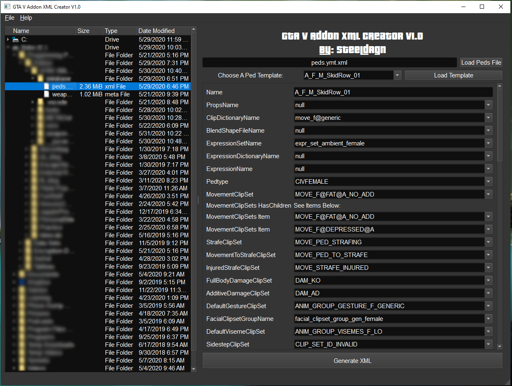

# Grand Theft Auto V Addon XML/Meta Generator V1.0

Tired of copying and pasting `XML` elements, changing desired parameters, and making sure your syntax is correct for every file your custom addon needs? This is the tool for you!

This is a GUI tool used to generate `.meta` files for custom addon peds, weapons1, and even vehicles1.

Now there is no need to copy, paste, and change individual files for every addon you make. Rest assured you will never forget a closing `XML` `</tag>` again.

>:information_source: This tool is intended for content creators as already made peds, weapons, and vehicles come with their modified files.

1 - :x: NOT CURRENTLY AVAILABLE. See planned features below.

### Current Features V1.0

:white_check_mark: :memo: Generate `peds.meta` file automatically

  - Automatically adds your custom ped to an existing `peds.meta` file if you have one already.

  - `Meta` file is human readable (*pretty printed*)!

:white_check_mark: Use an existing ped template for quick `meta` file generation

  - Tweak what you want, how you want quickly.

:white_check_mark: Shows all possible native entries for each ped parameter
 
:white_check_mark: Full graphical user interface

:white_check_mark:  :pushpin: Persistent directory tree

  - Last file used will show up again in the directory tree! Avoid having to expand and collapse the tree manually at every startup!
  
## Planned Features

:white_large_square: Add logging support for issues.

:white_large_square: Generate addon `weapons.meta` file and all associated weapon files.

:white_large_square: Generate addon `vehicles.meta` file and all associated vehicle files.

:white_large_square: Ability to add custom tags/ add more tags for a parameter set (eg. `MovementClipSets` in `peds.meta`).

:white_large_square: Smarter parameter value searches along with specific parameter search.

## How To Use

1. **Load Database**
   - Double click the `peds.ymt.xml` file located in the `database` folder from the left directory tree. 
     - Use the directory tree on the left or the menu bar.
     - You should see the path to the file autopopulate the box next to the `Load Peds File` button.
   - This will load a database of peds that you can use as a template for your addon ped.
   - There is a total of  :heavy_exclamation_mark: **683** different peds with :heavy_exclamation_mark:  **71** parameters per ped! Most ped parameters are unused.
2. **Select Ped Template**
   - Select a ped template to use as a starter. This saves time having to input each parameter individually.
   - Click `Load Template` button
3. **Edit Parameters**
   - Tweak and edit any parameter you would like.
   - Minimum change should be the name for your custom ped.
4. **Generate `META` file**
    >:warning: Warning: This will overwrite an existing `peds.meta` file and append the ped to the file. If this was a mistake, locate the generated file and delete the generated entry.
   - Click the `Generate XML` button and pick a save location.
   - You must double-click the directory you want the file to save to.
   - If you cancel the prompt, the default save location will be wherever this program lives.
5. **Enjoy!**
   - Locate your generated `peds.meta` file and move it to your desired location.
   - Enjoy your addons!

## Change Log

V1.0 - Initial release. Addon peds support with GUI.
